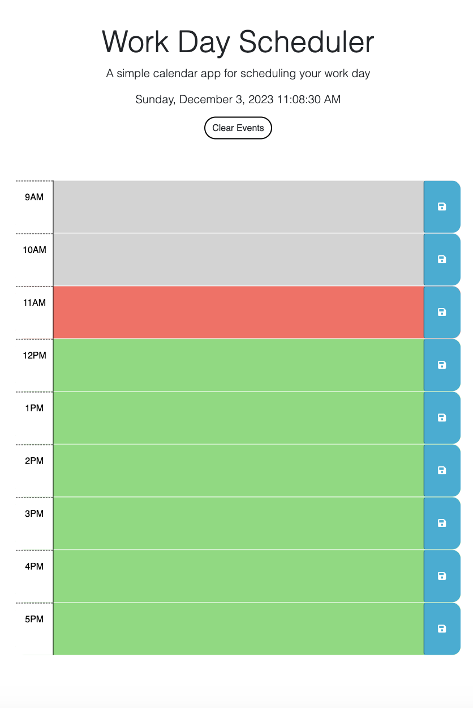

# work-day-scheduler

## Description

In this project, I used 1 HTML, 1 CSS, and 1 JavaScript file. I added the CDN for jQuery and dayjs so that I could access them while writing my JavaScript code. By using the HTML code given, I duplicated it and added data-row-id to the parent divs so that I could access a full days worth of events in my JS code. Once in the JS code, I added the date/time, a conditional statement in order to change the background of the events depending on the time of day, functions to save the textArea to localStorage to be accessed still when the page reloads if the click event was called, as well as a clear events button to clear the localStorage and any saved textArea input without needing to reload the page.

## Installation

N/A

## Usage

Screenshot of the Application:

You can access the deployed application [here](https://aaron-ross-sanchez.github.io/work-day-scheduler/)

## Credits

coding-boot-camp/crispy-octo-meme, 
Xpert Learning Assistant for help with .closest() and .find() methods,
https://www.w3schools.com/ for JavaScript references

## License

Please refer to the LICENSE in the repo.
